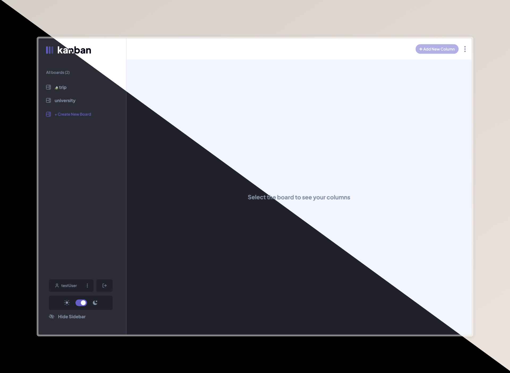
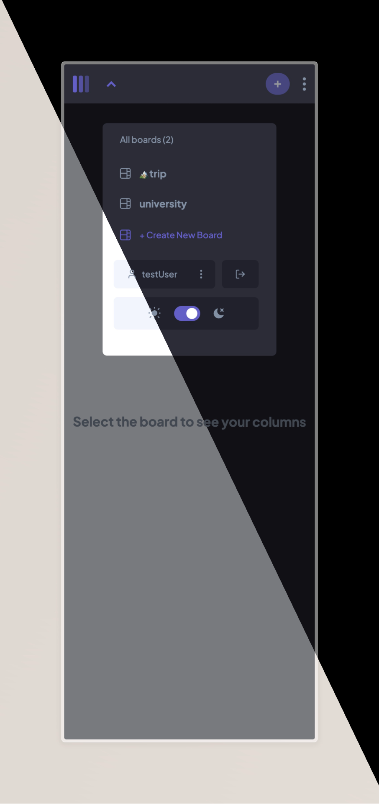

# Task Management App Solution

This is a solution to the [Task Management App challenge on Frontend Mentor](https://www.frontendmentor.io/challenges/kanban-task-management-web-app-wgQLt-HlbB).

## Table of contents

- [Overview](#overview)
  - [The challenge](#the-challenge)
  - [Screenshot](#screenshot)
  - [Links](#links)
  - [Built with](#built-with)
- [Author](#author)

## Overview

### The challenge

Users should be able to:

- View the optimal layout for the app depending on their device's screen size ✅
- See hover states for all interactive elements on the page ✅
- Create, read, update, and delete boards and tasks ✅
- Receive form validations when trying to create/edit boards and tasks ✅
- Mark subtasks as complete and move tasks between columns ✅
- Hide/show the board sidebar ✅
- Toggle the theme between light/dark modes ✅
- **Bonus**: Drag and drop tasks to change their status and reorder them in a column ⛔️
- **Bonus**: Keep track of any changes, even after refreshing the browser ✅
- **Bonus**: Build this project as a full-stack application ✅

### Screenshot

#### Desktop View

#### Mobile View

### Links

- Solution URL: [FrontEndMentor]()
- Live Site URL: [Vercel]()

### Built with

- Mobile-first workflow
- [Next.js](https://nextjs.org/) - React framework
- [React](https://reactjs.org/) - JS library
- [Tailwind CSS](https://tailwindcss.com/) - For styles
- [Appwrite](https://appwrite.io/) - Backend as a Service

## Author

- GitHub - [Moorroww](https://github.com/Moorroww/)
- LinkedIn - [Norbert Adamus](https://www.linkedin.com/in/norbert-adamus-6248291b6)
- Frontend Mentor - [@Moorroww](https://www.frontendmentor.io/profile/Moorroww)
